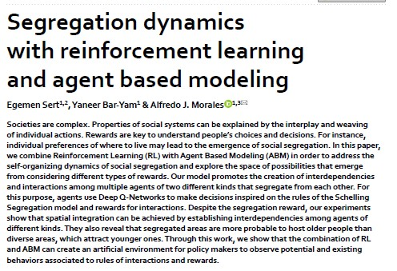
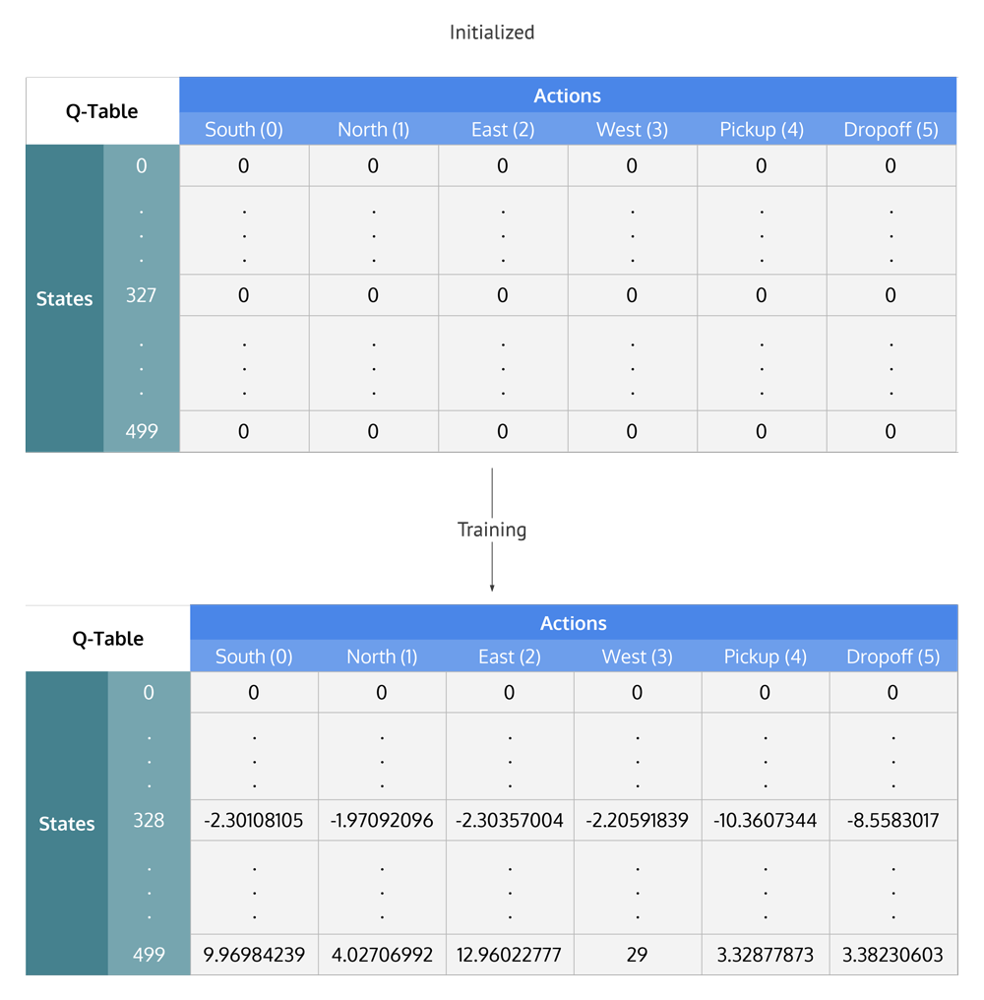
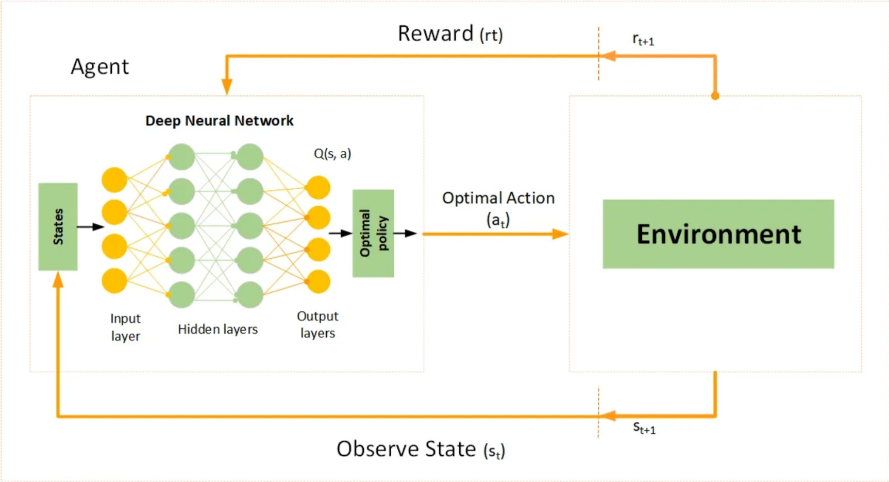
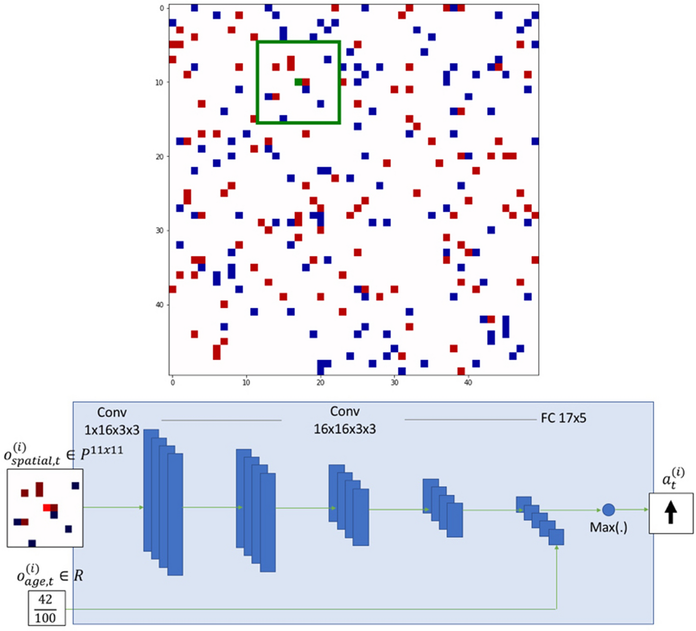
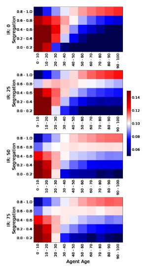

```{r setup, include=FALSE}
knitr::opts_chunk$set(echo = TRUE)
```

## Agent-based modeling

Agent-based models (ABMs) are computer simulations made up of a population of “agents” that can interact with an “environment” and with each other

## Agent-based modeling

These interactions are governed by a set of algorithmic rules the modeler designs

Rules are usually a simple approximation of reality, whose purpose is to simulate how a system will evolve over space and time

## Agent-based modeling

But researchers don't just use ABMs to mimic reality, they're a also a really useful experimental tool

Often we use ABMs to test how changing the parameters for agents or their environment can transform outcomes

## Agent-based modeling

As a dynamic multivariate modeling tool, ABMs are well-equipped to reveal **emergent** phenomena

**Emergence** refers to system-level outcomes or behaviors that are irreducible (roughly equivalent to more than the sum of the system's parts)

## ABMs and complexity science

Characteristics of complex systems:

- emergence
- non-linearity
- feedback processes
- evolution
- hysteresis (spatial and temporal lags)
- non-stationarity (where the behavior of the system is non-constant)
- threshold effects and phase changes

## ABMs and complexity science

Complexity science is an interdisciplinary field of inquiry that uses computational modeling to understand complex systems

ABMs are one of complexity scientists' absolute favorite tools

## Agent-based modeling

ABMs exemplify the value of using computer simulations to understand social, ecological, and socio-ecological systems

When compared to real-world experiments, ABMs:

- Are cheaper and safer
- Have fewer constraints
- Are better equipped to reveal emergent phenomena
- Allow modelers to speed up time and see long-run behavior unfold in a few minutes

## Agent-based modeling

Limitations:

-	Only as good as model assumptions about population and environmental attributes and update rules
-	Missing variables can mean the model outputs are *egregiously* wrong
-	Given their forecasting and counterfactual-testing nature, can be very hard to validate

## Programming ABMs

- CRAN package in R: ABM
- NetLogo
- Python

## Schelling's segregation model


## Schelling's segregation model

"Economists are familiar with systems that lead to **aggregate results** that the individual **neither intends nor needs to be aware of**."

"My conjecture is that the interplay of individual choices, where unorganized segregation is concerned, is a **complex system with collective results** that bear no close relation to individual intent."

## Schelling's segregation model

- One dimensional ABM made up of **+** and **0**
- Shows how, if there is even a slight individual preference for being in the majority, this leads to significant segregation at the population level

## Schelling's segregation model

- Model #2 attempts to estimate a tolerance limit by experimenting with different distributions of tolerances of out-group/in-group ratios
- Samples from uniform distribution (range 0 to 2)
- Ratios must be quite steep to lead to a stable mixed equilibrium

## Schelling extension

ABMs like these can be revealing, but here the agents themselves and the rules that guide them are fixed

**What would happen if the agents could learn?**

## Machine learning

Major paradigms of machine learning:

- supervised
- unsupervised
- reinforcement

## Schelling extension with reinforcement learning



## Reinforcement learning

Essential components of reinforcement learning (RL):

- Agents
- Environments
- States (*s*)
- Actions (*a*)
- Rewards (*r*)
- Policy ($\pi$)
- Value function or discount rate

## Reinforcement Q-learning

Basic **Q-learning** formula:

$$
Q(s,a) \leftarrow Q(s,a) + \alpha \left[r + \gamma \max_{a'} Q(s',a') - Q(s,a)\right]
$$
- *Q*(*s*, *a*) = expected total reward for taking action *a* in state *s*
- $\alpha$ = learning rate
- $\gamma$ = discount factor
- *r* = actual reward
- *s'*, *a'* = next state, possible next action

## Reinforcement Q-learning

{height=200px}

## Deep Q-learning

For complex environments, use **deep Q-learning** to supercharge the simulation

When full state space is too large to search/compute, **DQL** batches possible situations and uses these compressed estimates to calculate loss function

Combines Q-learning with neural network

## Deep Q-learning




## Schelling extension with reinforcement learning

Sert et al. (2020):

- two types of agents belonging to different groups
- in addition, new mix of rewards leading to interdependencies 
- model designers add the parameter Age, which they use to *recommend* policies to different agents

## Schelling extension with reinforcement learning

When environments are 2D grids, DQL models are based on **convolutional neural network** architecture

{height=200px}

## Schelling extension with reinforcement learning

Loss function:

$$
L(\theta) = \left( r + \gamma \max_{a'} Q_{\text{target}}(s', a'; \theta^-) - Q(s, a; \theta) \right)^2
$$
Training involves calculating the loss and backpropagation

$\theta$ parameter is what's being tuned

## Schelling extension with reinforcement learning

Reward values **R** are scalar values that agents receive at each interaction after evaluating their current state and action:

*R* = *SR* + *IR* + *VR* + *DR* + *OR* + *TR*

**SR** = segregation reward/penalty

**IR** = interdependence

**VR** = vigilance

**DR** = death

**OC** = occlusion

**TR** = stillness

## Schelling extension with reinforcement learning

{height=250px}

## Schelling extension with reinforcement learning

New model's findings:

Suggest greater interdependence can overcome low initial tolerance levels

Younger agents are more adaptable, owing to their higher interactivity 

Older agents are less tolerant and, due to lower move rates, are less likely to learn tolerance over time
