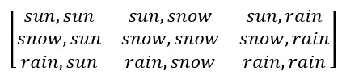

```{r setup, include=FALSE}
knitr::opts_chunk$set(echo = TRUE)
```

## Random walks

**Random walks** are useful in *random sampling* a variable x

Example: integer number line as an example sample space

Start at x = 0, and at every timestep, we can move 1 digit to the right (+) or left (-)

Each step is independent of the prior step

## Random walks

We want to know, after *N* steps, where we'll end up

## Random walks

Modeling the random walk by hand is easy enough in low dimensions, if time consuming

In high dimensions, it's basically impossible

So we employ computer simulations to do this for us

## Central limit theorem

These simulations hint at one of the foundational results of the theory of random walks, the **central limit theorem**

When the values of a random variable **x** are independent and identically distributed ("i.i.d"), and the size of the step (aka the mean and mean squared displacement between steps) is finite, then the long-run probability of **x** is equal to 

$$
f(x) = \frac{1}{\sqrt{2\pi\sigma^2}} \exp\left( -\frac{(x - \mu)^2}{2\sigma^2} \right)
$$


##  Central limit theorem

More explicitly, the central limit theorem says that the distribution of sample means is normally distributed

In the case of a random walk on the 1D number line, the sample means encode the average change in our location on the number line

Where, if *S* describes this mean displacement, then the sampled location *X* after *N* steps is *SN*

## Conditional probability

A key assumption of random walks is their independence

But we could improve upon our estimates of where we end up by recognizing that our next location on the number line depends on our current location?

## Conditional probability

Remember the concept of conditional probability

- the probability of event A depends on our knowledge of whether another event B has already occurred


$$
P(A|B) = P(A \cap B) / P(B)
$$

##  Frequentist probability

Conditional probabilities can be **frequentist**, wherein the probabilities are based on the long-run frequency of events (estimated by sampling data)

**Bayesian** theory provide an alternative approach that more explicitly encodes conditional probabilities

(All Bayesian models are based on conditional probabilities, but not all conditional probability models are Bayesian)

## Markov chains

What if we made the random walk just a little bit conditional?

In **Markov chains**, the future state depends on the current state - and the current state, only.

$$
P(X_{n+1} = x \mid X_{n} = X_{n})
$$

## Markov chains and transition matrices

When we model Markov chains computationally, we encode the relationships between X at timestep n and X and timestep n+1 in a "transition matrix"

In other words, we need to create a matrix whose elements represent the probabilities of state B given state A

## Markov chain example

The matrix

{width=100px}

encodes the relationships

{width=250px}

## Markov chains

Let's see what a simulation of these dynamics would look like >>>

## Bayes' theorem and Bayesian reasoning

Bayesian approaches to probability use evolving beliefs about the likelihood of events to estimate probabilities

Start with some beliefs about X and instatiate those as a *prior* distribution

Collect some observations, and integrate these observations into our prior to come up with a new distribution, known as the *posterior*

## Bayes' Theorem

Bayes' Theorem describes the probability of a hypothesis given some observed evidence:

$$
P(A \mid B) = \frac{P(B \mid A) \cdot P(A)}{P(B)}
$$


Where:
-\(P(A)\) is the prior probability of A,
-\(P(B \mid A)\) is the likelihood of observing B given A,
-\(P(B)\) is the total probability of B,
-and \(P(A \mid B)\) is the posterior probability of A given B

## Monty Hall Paradox

You're participating in a contest and are given the choice of **three** doors.  Behind **one** door there is a car, and behind the other **two** doors there are goats.

You pick a door (e.g., #1), and the host "Monty", who knows what's behind each door, opens another door (e.g., #3), which has a goat.

Monty then offers you the opportunity to switch to the other unopened door (#2).

Should you switch doors?

## Simulated example of Bayesian probability

Use Bayes’ Theorem to compute the posterior probability that a person has the disease given a positive test result:

- Prevalence of the disease: 1%  
  $P(\text{Disease}) = 0.01$

- Test Sensitivity (true positive rate): 99%  
  $P(\text{Positive} \mid \text{Disease}) = 0.99$

- Test Specificity (true negative rate): 95%  
  $P(\text{Negative} \mid \text{No Disease}) = 0.95$  
  
  → So, false positive rate: 5%
  $P(\text{Positive} \mid \text{No Disease}) = 0.05$

$$
P(\text{Disease} \mid \text{Positive}) = \frac{P(\text{Positive} \mid \text{Disease}) \cdot P(\text{Disease})}{P(\text{Positive})}
$$


##  Calculating P(B)

{width=450px}

## MCMC:  Metropolis(-Hastings) and Gibbs sampling

In Bayesian inference, P(B) is difficult to compute analytically (for anything other than simple distributions, it’s intractable)

However, we can use MCMC to sample from the posterior distribution - the one we want - if we know:

- the numerator (for the Metropolis and Metropolis-Hastings algorithms)

- the distribution of one parameter A given all the other parameters (Gibbs sampling algorithms)

##  Uses in machine learning

Given what you know about machine learning, why might Bayesian approaches to probability be especially useful?
