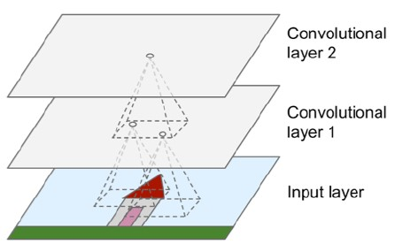

```{r setup, include=FALSE}
knitr::opts_chunk$set(echo = TRUE)
```

## Deep learning

Special type of machine learning, usually referring to training deep neural networks

## Deep learning

{width=250px}

## Deep neural networks

DNNs are artificial neural networks (ANNs) with several (typically at least 2 hidden) layers

They are vaguely inspired by biological neural networks

{width=250px}

## Deep neural networks

{width=250px}

## Deep neural networks

- Relatively old idea, proposed back in the 1940s
- Remained mostly theoretical until 1990s, when new algorithms + more compute power made training ANNs possible
- Even then, usually not enough training data or compute power to train models
- In the 2010s, exponential growth of data + compute power made complex ANNs possible

## Deep neural networks: Basics

The basic unit of an ANN or DNN is a **neuron**, which is a *threshold logic unit* (TLU)

At each step, the TLU computes the weighted sum of its input and then outputs a result based on a *step function* (old NNs) or *activation function* (new NNs)

Different activation functions can be used

## Deep neural networks: Basics

{width=250px}

## Deep neural networks: Basics

*Step functions* take a single real number as input and output a value (0 or 1) based on whether the number is greater than or less than a pre-specified threshold (this is basically a simple ON/OFF switch)

*Activation functions* decide whether a neuron should be activated (included) or not based on the weighted sum of inputs and a bias term (this introduces non-linearity into the model and allows it to find complex patterns in the data)

## Deep neural networks: Basics

A perceptron is a single layer of TLUs

{width=250px}

## Deep neural networks: Basics

A multi-layer perceptron (MLP) consists of more than one layer of TLUs

{width=250px}

## Deep neural networks: Training

For each training data record (in supervised learning), the algorithm feeds it into the DNN and computes the output of every neuron in each layer (this part is known as the *forward pass*)

The algorithm then measures the difference (error) between the final output of the DNN and the label of the training data (this step is called *error measurement*)

Finally, the algorithm *backpropogates* the error to the neurons in the hidden layers and adjusts the weights of the connection (the *backward pass*)

## Deep neural networks: Training


## Deep neural networks: Training


## Deep neural networks: Training


## Deep neural networks: Training

One complete pass of the DNN is known as an *epoch*

## Deep neural networks: Training

Various activation functions exist, including

- logistic
- tangent
- ReLU

## Deep neural networks: Training

The **logistic function** is especially useful when *x* is a variable value between 0 and 1

Especially useful for binary classification, and the output can be interpreted as a probability

$$
\sigma(x) = \frac{1}{1 + e^{-x}}
$$


## Deep neural networks: Training

The **tangent function** outputs a value between -1 and 1, but has some issues with *vanishing gradients* (where the gradients of the errors become so small at lower layers the training process can no longer update the weights)

$$
\tanh(x) = \frac{e^x - e^{-x}}{e^x + e^{-x}}
$$


## Deep neural networks: Training

The **ReLU function** (short for Rectified Linear Unit) is the most commonly used activation function

It outputs *x* if *x>0*, and *0* otherwise

$$
\mathrm{ReLU}(x) = \max(0, x)
$$


## Deep neural networks: Gradients

The opposite of *vanishing gradients* are *exploding gradients*, where the gradients become so large the model can't **converge** in the training process 


## Deep neural networks: Gradients

These vanishing and exploding gradients are the biggest challenge for DNNs

Was a really big problem in the past, when the weight parameters were initialized based on a normal distribution with a mean of 0 and a standard deviation of 1

Generated many weights close to 0...and led to many gradients close to 0

## Deep neural networks: Initialization

New weight initialization from different probability distributions addressed these problems

- Xavier initializations, where weights are drawn from a random uniform distribution OR a normal distribution with a mean of 0 and a standard deviation of sqrt(2/inputs+outputs)

## Deep neural networks: Optimizer

Optimizers help ML models reach their best parameters, signified by a minimized loss function

{width=250px}

## Deep neural networks: Optimizer

There are several optimizers to choose from, including Stochastic Gradient Descent (SGD), Adam, and Nadam (among others)

Each will give you slightly different performances because of the random factors involved

Adam has become the most-used and typically performs well

## Deep neural networks: Loss function

- cross-entropy for classification
- Mean Squared Error for regression

## Deep neural networks: Model output

In regression tasks, the model outputs a predicted value based on the features in the training data

In classification tasks, we use the *softmax function* to convert any output of the model into a probability distribution that sums to 1

## Deep neural networks: Model output

{width=px}


## Convolutional neural networks

CNNs are a special type of DNN

In generic DNNs, each neuron is fully connected to all the neurons in the previous layer

By contrast, CNNs use **convolutional layers**, where each neuron is connected to only the nearby neurons (e.g., neurons in a 3x3 window, or however we define the *receptive field*) in the previous layer

## Convolutional neural networks

CNNs are often used in image processing, where neurons are organized in a 2D space

{width=250px}

## Convolutional neural networks: Feature maps

One convolutional layer can have many feature maps (information distributed in a 2D space)

Each feature map is generated by a filter applied to the output of the previous layer

{width=250px}


## Convolutional neural networks: Filters and weights

*Filters* are arrays of weights; the size of the array is based on the receptive field, and the weights of the array are obtained during the training process

{width=250px}


## Convolutional neural networks: Pooling layers

**Pooling layers** are intermediate layers that aggregate the output up to that point

Exist to reduce computational load, memory usage, and number of parameters to control for overfitting

## Convolutional neural network

