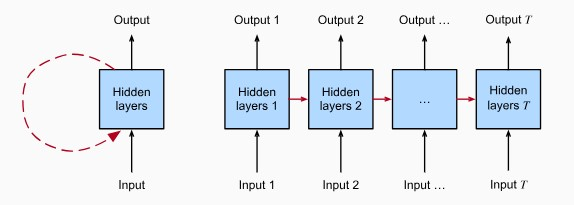
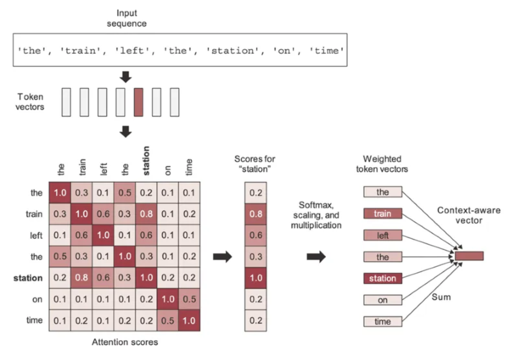
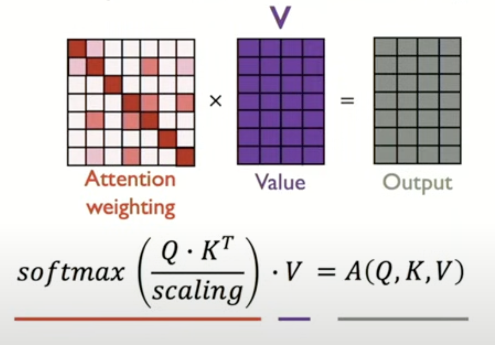
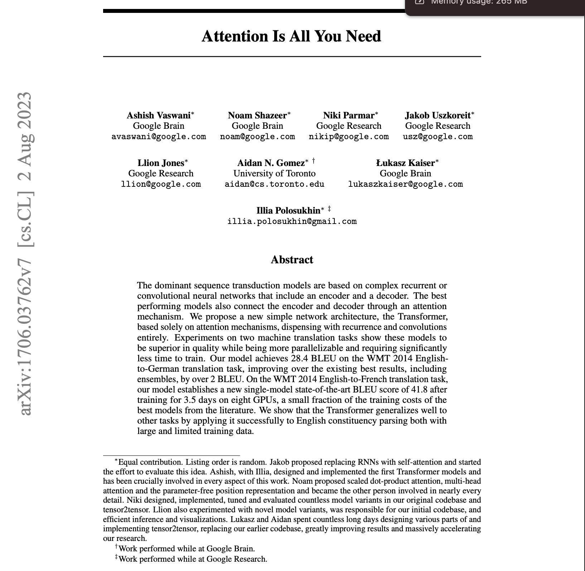
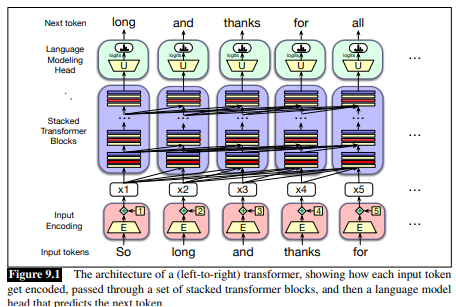
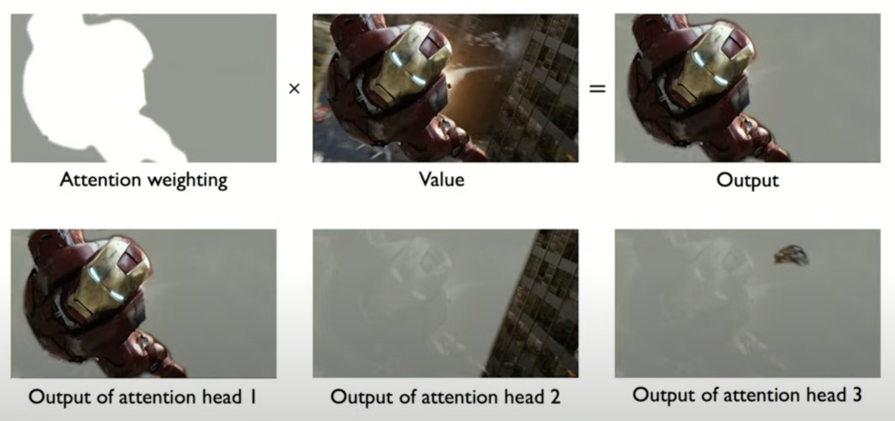
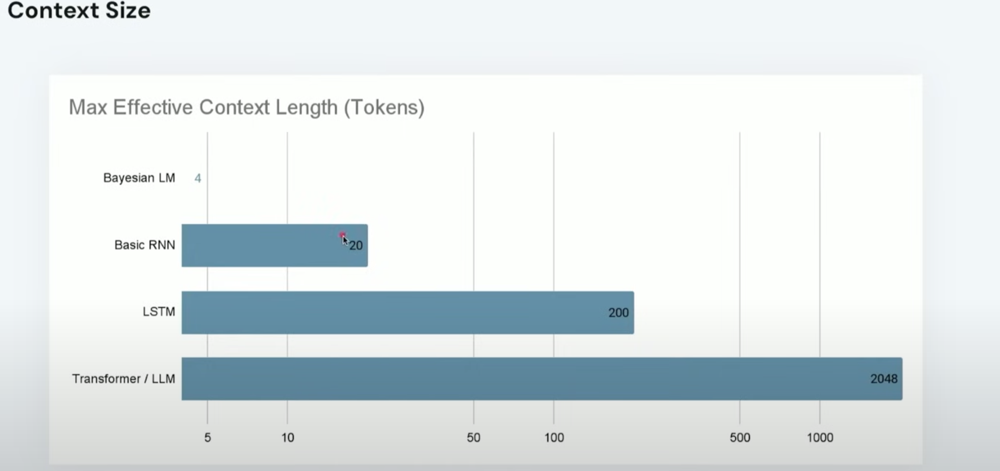

```{r setup, include=FALSE}
knitr::opts_chunk$set(echo = TRUE)
```

## Sequential data

Up to this point, most of our applications of deep neural networks involved 1D structured, or tabular, data

Then, with convolutional neural networks, we looked at predictive modeling for 2D image data

Now let's talk about models that are specially designed to work with with sequential data, which often occurs in unstructured, text form

## Sequential data

What is sequential data?  Some examples...

Given < an observation X in one of the example systems we've named >, can you predict what the next observation of X will be?

What information do we need to improve our predictions?

## Modeling sequential data

Markovian vs. non-Markovian processes

## Modeling sequential data

Many inputs, one output : Text in, sentiment out

One input, many outputs : Image in, caption out

Many inputs, many outputs:  Text in language A in, text in language B out

## Recurrent Neural Networks

How can we use neural networks to tackle these problems?

**Recurrent neural networks** are a class of deep learning models that capture the dynamics of sequences via recurrent connections

*Recurrent* connections are best conceptualized as cycles in the network of neurons

## Recurrent neural networks: Feedback loops

Put differently, RNNs extend the components of a neural network model (weights, bias terms, multiple layers, activation functions) to also include *feedback loops*, which can in turn handle the temporal (before and after) nature of sequences

These feedback loops extend the kind of data we can use to include sequential input values (time series, audio waves, printed language, etc.) 

## Recurrent neural networks: Diagramming the process

>> diagram

## Recurrent neural networks: Hidden states

Link time steps together (such that output at a later timestep depends on several earlier timesteps) by introducing another variable $h_t$ that represents the **state** of the neuron at each time, which propagates forward and is integrated at each time step

Such that $\hat{y}_t = f(x_t, h_{t-1})$

where $\hat{y}_t$ is the output, $x_t$ is the state at time $t$ and $h_{t-1}$ are the previous states, or the past memory

## Recurrent neural networks: Unrolling the feedback loop

These recurrent connections add an "unrolling" mechanism to the feed forward processes in other network models



## Recurrent neural networks: Recurrence relation

So, we have this state $h_t$ that we are updating through a *recurrence relation* 

The recurrence relation trains the weights $w$ we want to apply to our input ($x_t$) and our previous states ($h_{t-1}$) at each time step:

$$
h_t = f_w(x_t, h{t-1})
$$


## Recurrent neural networks: Updating the state

To update the hidden state $h_t$, we apply individual sets of neural network weights to our (1) past history $h_{t-1}$ and (2) our current input vector $x_t$, then add these together

Then we apply a non-linear **activation function** (e.g., tanh or ReLU), ultimately producing an output vector

$$
\mathbf{h}_t = \tanh(W \mathbf{x}_t + U \mathbf{h}_{t-1})
$$

$$
\hat{y}_t = W \mathbf{h}_t
$$

## Recurrent neural networks: Tuning the weights

The weights in the RNN model are encoded in a shared weight matrix, and tuning these weights involves computing a **loss** at each time step 

Sum the losses for the individual time steps to get the **total loss** for the model (reminder that in neural networks, our optimization function is designed to *minimize the loss*, or the difference between the actual versus predicted target variable)

In RNNs, the **backward pass** takes the total loss and **backpropogates** the loss across all these different time steps, updating the weights in turn

## Recurrent neural networks: Gradients

For each epoch, we calculate how the loss has changed for the new set of weights

This produces a **loss function**

The **derivatives** of our loss curve are known as the model's **gradients**

As our model learns, the **gradients** are used to minimize the **loss function** (ideally without vanishing or exploding themselves)

## Recurrent neural networks: Gradients

As in DNNs, to avoid vanishing or exploding gradients in RNNs, we need to make some design decisions about activation functions and how to initialize our weights

But we can also use a "gated cell" mechanism that optionally lets information through to the next time step - this is the architecture known as **Long Short Term Memory**

LSTMs are another popular ML model for text-based data

Designed to better handle long term memory needs by addressing the vanished gradients from much earlier time steps (gradients shrink exponentially during backpropagation through time, or BPTT)

## Recurrent neural networks: Limitations

- No parallelization (model only moves along one axis at a time making it slow and inefficient)
- Weak long term memory (vanishing gradients due to BPTT)

## Sequential Modeling: Improving efficiency

Q.  How could we make these sequential models more efficient?

A.  Design an NN to **highlight the parts of the sequence that are *most important***, thereby focusing the model's ***attention***

## Sequential Modeling: Attention

**Attention**, and more specifically ***self-attention*** is a mechanism for attending to, and extracting, the most important parts of a sequence

*Self-attention* frees us from handling our sequential data time step by time step, though we'll still need information about position and order

## Sequential Modeling:  Attention

To identify and attend to most important features in input,

(1) encode **position** information (using a *positional encoder* to produce a *position-aware embedding*)

(2) extract **query, key** for parallel search (these are matrices)

## Sequential Modeling:  Attention

(3) compute the **similarities** among each query and key matrix (pairwise), and use these to determine the **attention weighting** given to each token
- the metric used to determine attention scores is a mathematical distance (hence, similarity) between matrices we calculate by taking the dot product of the rows of the Q and K matrices, scaling them, and then squishing them with the Softmax activation function to get an attention weight between 0 and 1

(4) multiply the attention weight matrix by the **value** matrix (the more precise result from the query process) to generate an output

## Language in neural networks: Embedding

Neural networks themselves cannot interpret words, and instead only understand numerical inputs (i.e., vectors or matrices of numbers)

To convert language to numbers, we use a process known as **embedding**

Start with a corpus of words, then translate those words into an index

**Embedding** in turn transforms indexes into a vector (or matrix) of fixed size

## Sequential Modeling: Attention

**Query**: Search for info (what we ask)

**Key**: Interacts directly with query, distinguishes objects from one another, allows us to identify which object is the most relevant and by how much (what we're matching our query against)

**Value**: Actual details of the object of interest, more fine grained than the key (what we retrieve)

## Language in neural networks: Tokenization

We need a flexible way to manage sequences of variable lengths

Tokens are just fundamental units of text that serve as the basis for natural language processing tasks

Not 1:1 relationship between word:token, but can include trailing spaces and even sub-words

For example, in OpenAI's tokenization scheme:

- Wayne Gretzky's quote "You miss 100% of the shots you don't take" has 11 tokens
- The text of the *US Declaration of Independence* has 1,695 tokens

## Sequential Modeling: Attention

{height=200px}

## Sequential Modeling: Attention



## Transformers

{height=250px}

## Transformers

Transformers have become the principal architecture for building large language models (LLMs)

Revolutionized speech and language processing

Left-to-right (autoregressive) language modeling takes sequences of tokens as input and predicts individual output tokens (the next word or phrase) by conditioning on the available prior context using the attention mechanism

## Transformers




## Transformers

The central idea is multi-head attention:

**Attention** is used to build contextual representations of a token's meaning by attending to and integrating information from surrounding tokens

Goal: for the model to learn how these tokens relate to each other over large spans

## Transformers

Process of creating a self-attention head, that will be incorporated into a larger network:

- Start with an **input token**
- These tokens then pass through a series of **transformer blocks**
- Each block is a multilayer network that calculates weights derived from attention scores
- Multiply attention score matrix by value matrix to generate an **output token**
- Layer these attention heads over one another to create the full network

## Transformers



## Transformer-based LLMs

- BERT (year = 2018, n_params = 340 m)
- GPT-3 (year - 2020, n_params = 175 t)
- LLaMA (year = 2023, n_params = 65 t)


## Transformer-based LLMs



## Transformer-based LLMs: Prompting

Example from **learnprompting.org**:

P: What is 100x100/400x56?

R: 280

## Transformer-based LLMs: Prompting

**learnprompting.org** example cont'd:

P: You are an MIT-trained mathematician.  What is 100x100/400x56?

R: 1400

*Lesson: Condition the model to return a more accurate response!*

## Transformer-based LLMs: Updating

To customize your own LLM, you can build on pre-existing weight matrices (so you don't have to redefine the weights of trillions of parameters - super expensive process) by just adding in an additional weight matrix

You can also use instruction tuning

## Transformer-based LLMs: Instruction tuning

Remember, all machine learning involves error-driven learning

Use step-by-step prompting to increase the model's chances of making, recognizing, and addressing errors

Instead of: *The cafeteria had 23 apples.  If they used 20 to make lunch and bought 6 more, how many apples do they have?* which returns an answer of 27

Use: *The cafeteria had 23 apples originally.  They used 20 to make lunch.  So they had 23-20=3.  They bought 6 more apples, so they have 3+6 = 9.*

## LLM poisoning and model collapse

Training on synthetic data (e.g., LLM-generated text that is scraped from the internet) can precipitate model collapse

Some synthetic data is OK, but too much can degrade performance

At the big AI companies, huge teams now devoted to model evaluation

Their task is increasingly difficult - and increasingly important - as text output sounds convincing but contains wrong information

