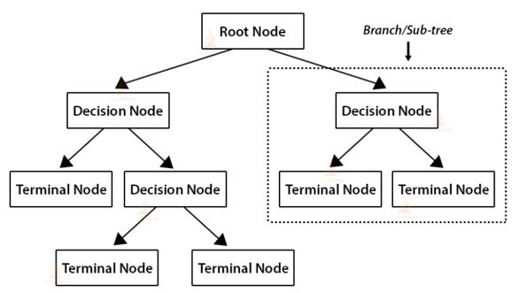
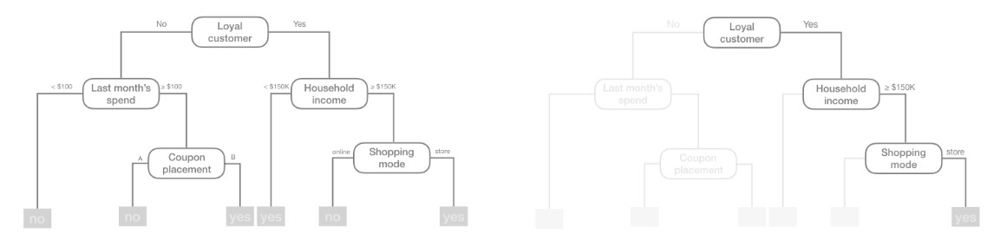

```{r setup, include=FALSE}
knitr::opts_chunk$set(echo = TRUE)
```

# Introduction

## Defining AI, machine learning, and deep learning

**Artificial Intelligence** is the study and design of machines or computational methods that can perform tasks that normally require human intelligence

**Machine learning** is a sub-field of AI that relies on statistical methods or numerical optimization techniques to derive patterns from data without explicitly programming every computing step

**Deep learning** is a special type of machine learning that leverages multiple layers of nonlinear processing units ("neurons") to learn representations from raw data to achieve the goal of automatic learning for completing various AI tasks

## AI, ML, DL

{height=250px}

## Learning methods

**Supervised** describes those methods that use labeled training data to learn and refine their predictions of the values or categories of unseen data

- determine the extent to which each feature variable (X) alone or with a combination of other feature variables (X1, X2, X3...), predict a target variable (Y)
- often used in regression and classification problems (e.g., what attributes predict housing prices?)

```{r}

```

## Learning methods

**Unsupervised** methods perform their analysis on data without an explicit target variable, and are designed to find patterns in the data without any programmed guidance

- can be used to find groups in data (clustering and segmentation) as well as to reduce dimensionality in the dataset (principal components analysis)
- also used in large language models (together with self-supervised learning and supervised fine-tuning)


## Learning methods

**Reinforcement** methods involve programming an agent that interacts with their environment and learns through trial and error

- often developed using a reward (and penalty) scheme
- used in gaming scenarios (e.g., AlphaGO) and to model complex systems (e.g., economic incentives, human-environmental interactions)


## Characteristics of ML/AI modeling

The typical ML/AI workflow involves splitting our existing data into "training" and "testing" sets

**Training set** includes data used to develop feature sets, train algorithms, tune hyperparameters, compare models, and all of the other activities required to choose a final model (the production-quality model)

**Test set** includes the data used to evaluate the final model's performance

!! DON'T TOUCH THIS TEST SET UNTIL YOU'VE SELECTED YOUR FINAL MODEL !!

## Train/test split

- easiest way to produce an unbiased population for each group is to take a random sample


>>See Train_test_split script


## Popular ML models

- Linear Regression (Ridge, Lasso)
- Decision Trees (Classification, regression)
- Random forest
- K-means, DBSCAN
- Support vector machine
- Naive Bayes

## Decision trees

Decision trees are "rooted" in decision theory or decision science

Named for their tree-like structure that models decisions and their possible outcomes

Use conditional control (e.g., if...then) statements to identify patterns for achieving a desired goal

## Decision trees



## Decision trees

Modelers use this tree-like structure for both classification (primary) and regression (secondary) tasks

Generates a model that predicts the *value* or *class* of a target variable by using the rules implied in the feature variables




## Decision trees

Decision trees are based on the CART (classification and regression trees) or ID3 or CD4.5 algorithms, which employ *recursive partitioning*

By extension, the most important mechanism in decision trees is the partition function:

At each node, the goal is to find the "best" feature to partition the remaining data into one of two or more groups

## Decision trees

"Best" means the overall error is minimized:

- classification: reduce either entropy or the Gini Index (thereby increasing the purity of the node)
- regression: minimize sum of squared errors, or SSE

## Decision tree partition functions: Classification

Gini Index :  A value between 0 and 1 that describes the purity of the node, i.e., the mix of classes that a feature represents (with 0 meaning more pure, fewer classes)

$$
\text{Gini} = 1 - \sum_{i=1}^{K} p_i^2
$$

Entropy :  A value between 0 and 1 that describes the information gain a given feature provides about a target feature

$$
H(X) = - \sum_{i=1}^{n} p_i \log_2 p_i
$$

## Decision tree partition function: Regression

In regression trees, we want to find the feature x and the split point s that minimize the total sum of squared errors (SSE) after the split

The resulting objective function is:

$$
\min_{j, s} \left[ \sum_{x_i \in R_1(j,s)} (y_i - \hat{y}_{R_1})^2 + \sum_{x_i \in R_2(j,s)} (y_i - \hat{y}_{R_2})^2 \right]
$$

where the y hats are the mean of the predicted values y in our two regions, R1 and R2.

## Decision trees

After finding the best feature, the splitting continues as many times as specified by the depth *hyperparameter*

(But note it's also possible to split the tree multiple times based on a value of a single feature :

The deeper the tree, the more likely a single feature will begin to dominate)

## Decision trees


## Decision trees

How deep should we make the tree?  If we make it too deep, we can end up **overfitting** our training data

- the model fits the training data so well it performs poorly on new data

Depth is one of several *hyperparameters* we can "tune" using the "early stopping" argument

We can also combat overfitting by "pruning" our tree, which tosses out the terminal nodes (leafs) that only predict a single observation

## Decision trees

Let's look at a few examples:

>> Decision trees script

Note that decision trees are: non-parametric, "white box" ML method, prone to overfitting

## Random Forest

As the name suggests, Random Forest combines many decision trees into a single model:

- ensemble learning
- uses the "wisdom of the crowd" to make more accurate predictions
- more computationally expensive


## Random Forest

For classification tasks, outputs the *mode* of the classes for a given observation

For regression tasks, outputs the *mean* prediction of the individual trees

## Random Forest


## Random Forest

Let's look at a few examples and compare their performance to individual decision trees:

>> Random Forest script
