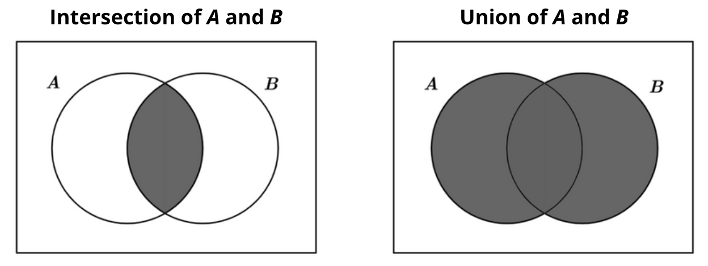

```{r setup, include=FALSE}
knitr::opts_chunk$set(echo = FALSE)
```

## Probability

Recall that probability is a value 

**between 0 and 1 that describes the likelihood of a certain outcome**.

## Key concepts

We want to learn how to calculate probabilities

For this, there are three **key ideas** we need to get comfortable with:

- sample spaces

- events

- outcomes

## Sample spaces

Sample spaces are defined as: 

**the *set* of all possible outcomes of an experiment or random trial**.

Let's decompose this definition:

## Sets

"the **set** of all possible outcomes of an experiment or random trial"

A *set* is a collection of *different* elements

For one example, if our "experiment" is rolling a die,

the sample space is the set of items 1:6, i.e. {1, 2, 3, 4, 5, 6}

## Sets cont'd

For another example, if we were to flip a two-sided coin twice,

the sample space is {HH, HT, TH, TT}

or, equivalently, {0 heads, 1 heads, 2 heads}

(either way of writing these is accurate)

## Possible outcomes

"the set of **all possible outcomes** of an experiment or random trial"

Sample spaces are collectively exhaustive 

(= all scenarios are contained within this set)

## Experiments and random trials

"the set of all possible outcomes of an **experiment or random trial**"

these experiments always have unpredictable/uncertain outcomes

(otherwise we wouldn't need to describe them probabilistically)

## Events

Events are **subsets** of the sample space

For example, what are the possible outcomes of tossing a die < 3?

{1, 2}

## Simple events

A **simple event** is an event consisting of a single outcome

(these are also known as *sample points*)

For example, rolling a 2 is the subset {2}

p(X = 2)

## Compound events

A **compound event** is an event that is created by aggregating two or more simple events

For example, the probability of drawing a card that is both a spade AND a 10

set1 = {diamonds, spade, hearts, clubs}

set2 = {2, 3, 4, 5, 6, 7, 8, 9, 10, J, Q, K, A}

For another example, the probability of drawing a card that is either a spade OR a 10

## Operations used to combine events

AND:  corresponds to the "intersection" of the probability of event A and event B

EITHER/OR: corresponds to the "union" of the probability of event A and event B



## Operations used to combine events

We find the sample space for compound events through the addition or multiplication of simple events

Given that UNIONS/INTERSECTIONS are larger than UNIONS/INTERSECTIONS, which do you think are associated with **addition** and which are associated with **multiplication**?

HINT: Remember that we are dealing with the multiplication or addition of fractions; or values between 0 and 1.

## Operations used to combine events

AND (intersection): Multiplication (multiplying two decimals leads to a smaller outcome than either initial element)

OR (union): Addition (adding two decimals leads to a larger outcome than either initial element)

## Exploring sample spaces and events using de Mere's problem

Recall the Chevalier de Mere's gambling problem.

He posited that **the probability of rolling at least one "ace" in four throws of a die was the same as the probability of rolling at least one double-ace in 24 throws of two dice.**

## de Mere's first problem

**What is the probability of observing at least one (1) ace in four (4) rolls of a die?**

Sample space = {1, 2, 3, 4, 5, 6}

Simple event of interest: {1}

Set of events where X != 1 : {2, 3, 4, 5, 6}

P(ace) = 1 - P(not ace)

**Complement rule**: the sum of the probability of an event and the probability of its complement (the event not happening) is always equal to 1

## de Mere's first problem cont'd

Let n = 4

P(X=1) = 1 - (5/6 * 5/6 * 5/6 * 5/6)

## de Mere's second problem

**What is the probability of rolling at least (1) double-ace in twenty-four (24) rolls of two (2) die?**

Sample space = {36^24 equiprobable outcomes, each of which combine two values 1:6}

Simple event of interest : {1, 1}

Set of events where X != {1, 1}: {35^24 outcomes, each of which two values 1:6 EXCEPT outcome 1, 1}

## de Mere's second problem cont'd

Let n = 24

P(X={1,1}) = 1 - (35^24)


