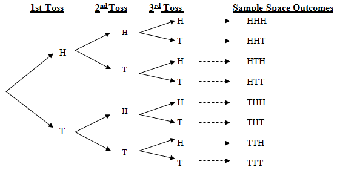

```{r setup, include=FALSE}
knitr::opts_chunk$set(echo = TRUE)
```

```{r, include=FALSE}
options(tinytex.verbose = TRUE)
```


##  Sample spaces, events, outcomes

Probability is a value **between 0 and 1 that describes the likelihood of a certain outcome**

**Outcomes** are the result of an experiment or random trial

**Sample spaces** are the set of all possible outcomes (collectively exhaustive and mutually exclusive)

**Events** are subsets of the sample space, and can either be *simple* or *compound*

##  Compound events

Compound events involve two or more simple events

Use language of "and" & "either/or" to describe the relationship between these simple events, e.g., A, B

For compound events A and B, "either/or" refers to the **union** of their two subsets

$$
P(A) \cup P(B)
$$

##  Addition

We generalized that **unions** use addition, but recall that also said there is **no double counting** in our probability sets

So, to formally calculate the likelihood of observing event A *or* event B, we use: 

$$
P(A \cup B) = P(A) + P(B) - P(A \cap B)
$$

##  Addition

This is known as the **inclusion-exclusion** principle:

To find the probability of A or B, add the probability of A with the probability of B, then subtract their overlap

##  Independence

When the simple events (e.g., A and B) are **independent** of one another, meaning the probability of A does not affect the probability of B (and vice versa):

$$
P(A \cap B) = 0
$$

The probability of A or B reduces to:

$$
P(A \cup B) = P(A) + P(B)
$$

## Addition example 1

We used the example of rolling a 1 or a 2 (6-sided die):

$$
P(A) = 1/6; P(B) = 1/6; P(A \cap B) = 0
$$
$$
P(A \cup B) = 1/6 + 1/6 - 0
$$
$$
= 2/6
$$
$$
= 1/3
$$

## Addition example 2

If we are interested in finding the probability of rolling **an even number** or **a number greater than 5**, we no longer have mutually exclusive events:

$$
set1 = \{2, 4, 6\}
$$
$$
set2 = \{6\}
$$

##  Addition example 2 cont'd

Instead, we now have:

$$
P(A) = 3/6;   P(B) = 1/6;   P(A \cap B) = 1/6 
$$

$$
P(A \cup B) = 3/6 + 1/6 - 1/6
$$

$$
= 3/6
$$
$$
= 1/2
$$


##  Multiplication

We generalized that compound events ("and") relating to **intersections** between simple events use multiplication

This is true, but let's add some nuance...

When the simple events (e.g., A and B) are **independent** of one another, meaning the probability of A does not affect the probability of B (and vice versa):

$$
P(A \cap B) = P(A)*P(B)
$$

##  Multiplication example 1

Consider the probability of observing the independent event (A) rolling a fair six-sided die, and (B) flipping a fair coin

Let event A be rolling an even number, such that:

$$
A = \{2, 4, 6\}
$$

$$
P(A) = 1/2
$$

##  Multiplication example 1 cont'd

Let event B be flipping a heads, such that:

$$
B = \{H\}
$$

$$
P(B) = 1/2
$$

Then:

$$
P(A \cap B) = 1/2 * 1/2
$$

$$
= 1/4
$$

##  Multiplication example 2

In 3 flips of a coin, what is the likelihood of observing two heads in a row?

Let's map out the sample space by hand, supposing (1) it's a fair coin and (2) it's a weighted coin 

NOTE: In both cases, these still represent **independent** events

##  Visualizing sample spaces (analog)



##  Multiplication example 3

What if there was some **dependence** between events A and B?

For example, drawing two Kings in a row from a standard 52-card deck *without replacement*

Let event A be drawing a King on the first try, such that:

$$
P(A) = 4/52
$$

Let event B be drawing a King on the second try, given that we drew a King on the first try **and did not replace the card**: 

$$
P(B|A) = 3/51
$$

##  Multiplication example 3 cont'd

The probability of both dependent events happening is:

$$
P(A \cap B) = P(A)*P(A|B)
$$

$$
= 4/52 * 3/51
$$

$$
= 12/2652
$$

$$
= 1/221
$$

##  Conditional probabilities

Conditional probabilities (signaled by the language A *given* B) arise regularly in our everyday lives.  

We use this approach to estimate the probability of A, when the fact of B occurring has changed our universe of possibilities.

To calculate, use:

$$
P(A|B) = P(A \cap B) / P(B)
$$

Note that if P(B) = 0, P(A|B) is undefined.

##  More tools for calculating sample spaces and probabilities

In math, **counting problems** are those questions that ask you to determine the *total number of possible outcomes given conditions like whether order matters or if items may be repeated in the selection process*

The tools we use for counting problems include:

- factorials
- the multiplication principle
- permutations
- combinations

##  Factorials

A factorial is the product of all positive integers less than or equal to *n*

Use **factorials** when counting the number of ways to arrange *n* objects

Denoted with a !  NOTE the convention that 0! = 1

$$
n!
$$

##  Factorial examples

How many ways can you arrange 5 rugby jerseys on a clothesline?

How many ways can you watch 4 different TV shows?


##  Multiplication principle for counting

For compound events (e.g., M and N), finding the number of ways we can arrange elements from M and elements from N involves using the **multiplication principle**:

If there are \(N\) ways to accomplish one task and \(M\) ways to accomplish a second task, then there are \(N*M\) ways to accomplish both tasks.

$$
M*N
$$

##  Multiplication principle example

If we have 8 dogs and 10 cats, how many unique sets of dogs and cats can we make?

$$
= 8*10
$$

$$
= 80
$$

##  Permutations

A **permutation** of a set with \(n\) items describes the number of ways to arrange that set in \(r\) groups where the **order matters**

The number of permutations for \(n\) items taken \(r\) at a time is given by:

$$
nPr = \frac{n!}{(n - r)!}
$$

## Permutation example

There are 8 Formula One cars on a race track, how many different ways can these cars end up on the podium (1st, 2nd, 3rd place)?

- First, define \(n\) and \(r\) (e.g., 8 and 3)
- Eliminate common factors (>= 5!)
- Solve remaining factorial ...

##  Combinations

**Combinations** describe the number of ways to arrange a set of \(n\) items into \(r\) groups where the **order DOES NOT matter**

The formula is similar to that of permutations, but includes some idiosyncratic notation and an additional factorial in the denominator:

$$
nCr = \binom{n}{r} = \frac{n!}{r!(n - r)!}
$$

##  Quick knowledge check

Given the same variables \(n\) and \(r\), is the nPr or nCr **larger**?

##  Combination example

If you've got 10 applicants for a job, how many different ways can you choose 3 of them?

- First, define \(n\) and \(r\)
- Parentheses
- Eliminate/reduce common factors
- Solve remaining factorial


