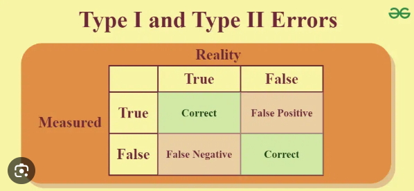

```{r setup, include=FALSE}
knitr::opts_chunk$set(echo = TRUE)
```

## Probability

We can use probability to understand, describe, and test the implications of uncertainty.

Or, **probability is a measure of uncertainty**.

## Probability

You do this in your daily life when you use language like

- "it's probably going to be OK"
- "X is unlikely to come to pass"
- "there's a good chance Y will happen"
- "odds are..."

in your decision-making processes

## Modeling

Q.  How do you come to conclusions like

- "it's probably going to be OK"
or "X is unlikely to come to pass"
or "there's a good chance Y will happen"?

A.  You've got a **mental model** of the probabilities of these outcomes already, which you can draw on when faced with any number of decisions.

## Modeling

Q.  Where did this mental model come from?

A.  **Evolution + data**

Our brains are wired to consume data (through our senses) and to hunt for patterns in it, including how often a given outcome happens.  

From here, we develop a set of expectations around what we are likely to see.

## Modeling

This brings us to the multiple, related definitions of "model":

- a miniature representation of the world (n.)
- a pattern of something to be made (n.)
- to create a small-scale replica or pattern for replication (v.)

We will engage each of these meanings in this class.

## Modeling

Q.  How good are our mental models?

A.  Only as good as our **data** and our **mental architectures** allow!

More experience (and thus more data) tends to produce better mental models, but we are also prone to misunderstandings and biases that can undermine "good" decision-making.

NOTE: In decision-making, we usually equate "good" with "rational". And probability is often used to determine what is rational.

## Probability and modeling

In fact, probability as a science dates to a gambling error in the 17th century.

## Probability and modeling

Antoine Gombaud, or the self-described **Chevalier de Mere**, contacted the mathematician **Blaise Pascal**, who in turn asked **Pierre Fermat**, for help explaining his (de Mere's) gambling losses.

de Mere was a dice player who thought that **the probability of rolling at least one "ace" in four throws of a die was the same as the probability of rolling at least one double-ace in 24 throws of two dice**.

Let's think about his reasoning for a moment by breaking it into two problems.

## Probability and modeling

**1.  What is the probability of having at least one (1) ace in four (4) rolls of a die?**
$$
\text{Let } X \text{ be the number of aces rolled when rolling a die four times.}
$$
$$
\text{The probability of rolling at least one ace is:}
$$
$$
P(X \geq 1) = 1 - P(X = 0).
$$
$$
\text{The probability of not rolling an ace on a single roll is: } P(\text{not ace}) = \frac{5}{6}.
$$

## Probability and modeling


$$
\text{Four rolls of a die may have one of } 6^4 = 1296 \text{ equiprobable outcomes.}
$$
$$
\text{Of these,} 5^4 = 625 \text{ are unfavorable,}
$$
$$
\text{leaving } (1296 - 625) \text{ favorable for the bettor.}
$$

$$
\text{The probability of getting at least 1 ace is then:}
$$
$$
P(X \geq 1) = \frac{1296 - 625}{1296} = \frac{671}{1296}\approx 0.5177 \ldots
$$
So far so good; as .51 > .5.

## Probability

**2. What is the probability of having at least one (1) double-ace in twenty-four (24) rolls of two (2) die?**

$$
\text{One double roll has } 6^2 = 36 \text{ equiprobable outcomes,}
$$
$$
\text{ of which 35 are unfavorable to the bettor.}
$$

$$
\text{In 24 rolls, there are } 36^{24} \text{ possible outcomes,} 
$$
$$
\text{ of which only } \left(36^{24} - 35^{24}\right) \text{ are favorable.}
$$

## Probability

$$
\text{Thus, the probability of winning the bet equals:}
$$
$$
P(\text{winning}) = \frac{36^{24} - 35^{24}}{36^{24}} = 1 - \left(\frac{35}{36}\right)^{24}
$$

$$
\approx 1 - 0.5086 = 0.4914
$$

## Probability

Over enough rounds of betting on rolling one double-ace in 24 throws, the Chevalier de Mere would on average *lose*.

So his mental model and rough calculation were ever so slightly *wrong*.

## Probability and modeling

Knowing humans can make such mistakes, scientists have developed ways to more objectively, and more precisely, describe uncertainty.

Beginning with Pascal and Fermat, scientists have developed methods to more precisely characterize the **probabilities** associated with an outcome of interest.

Specifically, **probability is a value between 0 and 1 that a certain outcome will occur**.

## Probability

Using such tools, we can answer questions like:

- If a team has a 60% chance of winning each game, how likely is a team to win 3 games in a row?
- If the fatality rate of a specific disease is 2%, what is the probability that out of 50 people infected, no one dies?
- The daily probability of an accident at an intersection is p = 0.42.  What is the probability that the next accident occurs three days from now?

## Probability and modeling

Probability also plays an important role in the **scientific method**.

Recall the scientific method is all about **hypothesis testing**.

- develop a hypothesis
- identify the methods you can use to test your hypothesis
- employ these methods (e.g., experiments and/or statistical tests)
- evaluate your hypothesis

## Probability and modeling

Probability figures into the scientific method in a few different ways.

For example,

Q.  Where do our hypotheses come from?

A.  Our mental models of the world.

We construct hypotheses from our perceptions of reality.

## Probability and modeling

Then, we often use random sampling and statistical tests, which are based on probability, to test our hypotheses.

- random sampling of a population (e.g., randomly assigning participants to treatment and control groups in a clinical trial ensures the groups are statistically comparable)
- using statistical tests to determine whether observed patterns are (un)likely to be due to chance
- depending on our findings, we can either apply these results to new predictions and/or update our mental models and form new hypotheses for further testing

## Modeling

Increasingly, computer simulations (which are another kind of model) are used to test scientific hypotheses.

- have become cheaper and more reliable as computer processing power has grown
- safer and more scalable than real-world experiments

e.g., an earth system model that brings together historical CO2 levels, initial temperature, humidity, ocean currents, and various CO2 emission scenarios to (1) describe, (2) explain, and (3) predict the outcomes of these variable interactions on, for example, global temperature change, regional weather patterns, and extreme events

## Modeling

In this class, we're going to use various computer simulations and tabletop games 

(1) as models of a world (in the miniature, controlled laboratory sense)

(2) to generate data, which we will in turn use to develop predictive models (in the patterns of inputs and corresponding outputs sense)

## Modeling

"All models are wrong, but some are useful" (attributed to George P. Box)

## Modeling

A useful model reduces the chance of both Type I and Type II errors.

 


