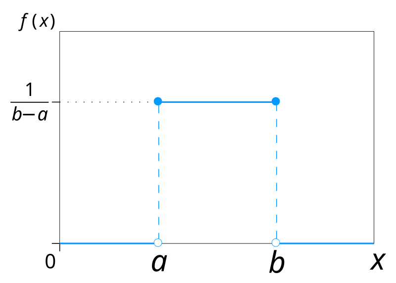
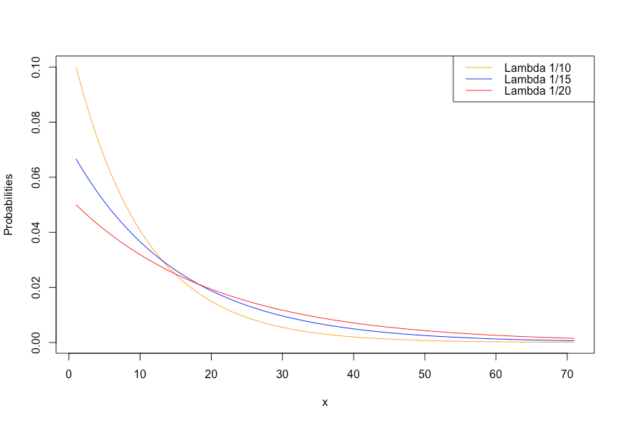

```{r setup, include=FALSE}
knitr::opts_chunk$set(echo = TRUE)
```

## Continuous processes

Discrete variables like the number of successes in *n* trials can only take on non-negative integer values

Continuous variables, by contrast, can take on any value within a range

Examples:

- distance traveled
- water volume
- size of a planet
- cost of a house

## Continuous processes

As with discrete processes, where we are interested in the relative frequencies (or histograms) of a *discrete* random variable X,

we are often interested in the relative frequencies and histograms of values for a *continuous* random variable X

## Uniform distribution

The simplest continuous distribution is known as the **uniform** distribution

It is the outcome of continuous processes with *equally likely* outcomes

If *a* is the minimum value, and *b* is the maximum value,

$$
f(x) = \frac{1}{b-a}, \quad a \leq x \leq b
$$

## Uniform distribution

Of note:

- height of the histogram is constant and is not a function of x (because every value of x is equally likely within the specified range); height = 1/(b-a)
- length of the rectangle is (b-a)
- area of a rectangle is length * height
- as with all probability distributions, the area under the curve equals 1

## Uniform distribution

{width=250px}

## Uniform distribution

What if, given that the selling prices for homes in a residential area were equally likely to be anywhere between 160k and 190k USD, we wanted to know the probability that a house sells for more than 170k?

## Uniform distribution

Probabilities are areas under the distribution curve

To find the area, take the product of the rectangle's length and its height
In this example:

- length = 190-170 = 20
- height = 1 / (190-160) = 1/30
- 20 * (1/30) = 2/3

## Uniform distribution

We can use the **cumulative distribution function** (denoted *F(x)*) to find the probability of obtaining a value less than *x*

$$
F(x) = \frac{x-a}{b-a}
$$
**Q**: How could you use this cumulative probability to find probability that a house sells for more than 170k (when *a* = 160 and *b* = 190)?

## Uniform distribution

What if we were interested in the probability that an observation falls between two values on the uniform distribution curve, e.g., x1 and x2?

This is equal to the probability that a value is less than x2 *minus* the probability that it is less than x1

$$
Pr(\quad x_1 \leq x \leq x_2) = \frac{x_2-x_1}{b-a}
$$

## Uniform distribution - examples 1 and 2

Suppose that the mean annual temperature for a location was uniformly distributed, between 10 degrees C and 18 degrees C, implying that each year any temperature in this range is equally likely to be the mean for the year.  (Note that this is an unrealistic example, in the sense that mean temperatures are not likely to have this kind of distribution.)

(1)  What is the probability that the annual temperature is less than 14 degrees C?

(2)  What is the probability that the mean annual temperature is between 12 degrees C and 15 degrees C?

## Normal distribution

The normal, or Gaussian distribution, is the most commonly occurring distribution

As with all probability distributions, the area under the curve equals 1

And the area under the curve between any two values of *x* is the probability of observing a value of *x* in that range

## Normal distribution

{width=250px}

## Normal distribution

The probability density function of the normal distribution is

$$
f(x) = \frac{1}{\sqrt{2\pi\sigma^2}} e^{-\frac{(x - \mu)^2}{2\sigma^2}}
$$
where:
- **pi** is the constant 3.14...
- **e** is the constant 2.718..
- **mu** is the distribution's mean
- **sigma^2** is the variance

## Normal distribution

To avoid having to use such a complex formula, we can convert our value(s) of *x* into *z-scores* (which tell us how many standard deviations we are from the mean) and then use a **look-up table** to find the corresponding probabilities of observing *x* (or a value that falls into a specific range)

Recall the formula for calculating *z-scores* is

$$
z = \frac{x - \mu}{\sigma}
$$
Note that in R, you can use the pnorm() function to look up the cumulative probability associated with a z-score


## Normal distribution

{width=250px}

## Normal distribution - example 1

If commuting times are normally distributed with mean 30 minutes, and standard deviation 16 minutes, find the probability that a commute is shorter than 35 minutes.

## Normal distribution - example 2

Using the same scenario, find the probability that a commute time is between 40 and 50 minutes.

## Normal distribution - example 3

Using the same scenario, find the probability that a commute time is less than 17 minutes.

## Normal distribution - example 4

Using the same scenario, find the probability that a commute time is between 25 and 45 minutes.


## Exponential distribution

The **exponential distribution** has a positively skewed shape (mean is greater than the median)

Phenomena where *x* has an exponential distribution:

- commuting distance
- personal income
- length of residential moves

## Exponential distribution

{width=250px}

## Exponential distribution

The probability density formula for calculating probabilities of *x* in such scenarios is:

$$
f(x) = \lambda e^{-\lambda x}, \quad x \geq 0
$$
where
- *x* is always non-negative
- *e* is the constant 2.718
- *lambda* is the height of the curve when *x* = 0 (higher values of lambda indicate steeper declines)

## Exponential distribution

{width=250px}

## Exponential distribution

As with the uniform distribution, we can use the **cumulative distribution function** in the context of the exponential distribution to find the probability of observing a value less than *x*:

$$
F(x) = Pr(X<x) = 1 - e^{-\lambda x}
$$
When *x* is small, *F(x)* is small; when *x* is large, *F(x)* is large

## Exponential distribution

By extension, the probability of obtaining an observation greater than *x* is

$$
1 - F(x) = Pr(X>x) = e^{-\lambda x}
$$

## Exponential distribution

For exponential distributions, the expected value is 

$$
\mu = \frac{1}{\lambda}
$$
and the theoretical variance is

$$
\sigma^2 = \frac{1}{\lambda^2}
$$

This lets us estimate the value of lambda from the sample mean (it's simply the reciprocal).  We can then calculate the variance from lambda.

## Exponential distribution - examples 1, 2, and 3

The distance of residential moves is found to be exponential, with lambda = 0.1 km.

(1) Find the probability that a residential move is less than 5 km.
(2) Find the probability that a residential move is longer than 3 km.
(3) Find the probability that a residential move is between 3 and 8 km.
