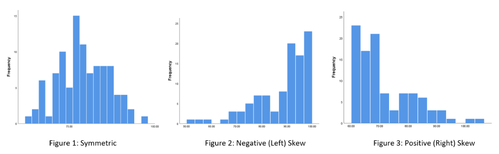
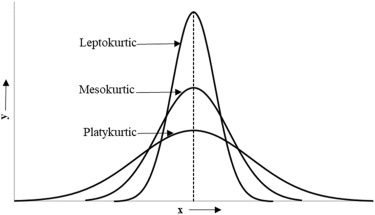
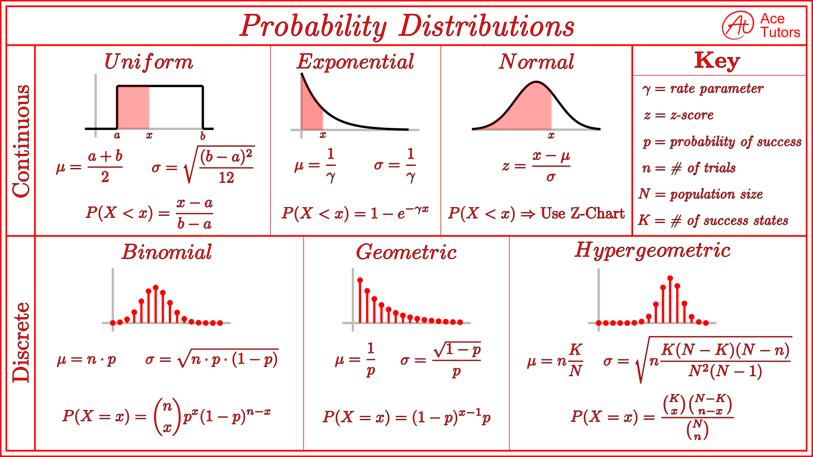

```{r setup, include=FALSE}
knitr::opts_chunk$set(echo = TRUE)
```

## Describe, explain, predict

Every scientist is involved in **describing**, **explaining**, and **predicting** phenomena

We use probability, which underlies the academic field of statistics and the practice of modeling, at each stage:

Descriptive statistics *describe* the phenomena

Inferential statistics *explain* the relationships that give rise to the phenomena

Models use probabilities to *predict* whether/how a phenomena will unfold in the future

## Structure of traditional statistics education

Descriptive >> Inferential >> Predictive

## This class

Descriptive >> Predictive

(You'll have gotten most of your inferential stats, e.g., t-tests or linear regression, in your traditional statistics classes)

## Descriptive statistics

Examples??

## Random variables

Flipping a fair coin or drawing a card from a standard deck may be relatively straight-forward exercises

But when sample spaces are unknown, we must collect observations from experiments or random trials

This data, which represents the values a **random variable** may take, provides insight into its sample space

## Visual descriptions of data

We use vertical bar graphs called **histograms** to visualize this data

It follows that histograms themselves are often used to represent a sample space (which may be updated as more data becomes available)

Examples: commuting distance, sleep times, first year class size

**Histograms** may be constructed from absolute or relative frequencies; their distributions will be the same in both cases

## Visual descriptions of data cont'd

**Box plots** are another useful way to represent a random variable's values

- Min, 25th, 50th, 75th percentiles, and Max, plus any outliers

(Outliers usually understood to mean those values exceeding 1.5x above or below the 25th and 75th percentile values)

## Measures of central tendency

The **sample mean** is simply the average of our observations (sum of obs divided by n of obs)

The **median** is the observation that splits the ranked list of observations (ranked from lowest to highest, or highest to lowest) in half; when the number of observations is even, take the average of the two values in the middle

The *mode* is the value that occurs most frequently

##  Measures of variability

The **range** is the difference between the min and the max

The **interquartile range** is the difference between the 25th and 75th percentiles

(Visualized by box plots)

##  Measures of variability cont'd

The *sample variance* is the average squared deviation of the observations from the mean

$$
s^2 = \frac{\sum (x_i - \bar{x})^2}{n-1}
$$ 
NOTE the *n-1* in the denominator is used to ensure the sample variance is an *unbiased* estimate of the true variance (sample estimate usually underestimates true variance, so a smaller denominator attempts to address this)

##  Measures of variability cont'd

The **sample standard deviation** is equal to the square root of the sample variance

By taking the square root of s^2, we put this measure of variability back on a scale which is the same as that used for the mean and the original data

$$
s = \sqrt{\frac{\sum (x_i - \bar{x})^2}{n-1}}
$$

##  Other numerical measures for describing data

**Skewness** measures the degree of asymmetry in the data + histogram



##  Other numerical measures cont'd

**Positive skewness** suggests there are more observations below the mean than above it
- mean > median

**Negative skewness** means there are more observations above the mean than below it
- mean < median

##  Other numerical measures cont'd

**Kurtosis** measures the degree of "peakedness" in the data

**Leptokurtic** distributions have a high degree of peakedness

Flatter histograms are known as **platykurtic**



##  Other numerical measures cont'd

**Standard scores** or **z-scores** are used to standardize observations that come from distributions with different means and different degrees of variability

$$
z = \frac{x - \bar{x}}{\sigma}
$$

##  Where we're headed




