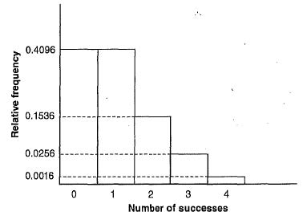

```{r setup, include=FALSE}
knitr::opts_chunk$set(echo = TRUE)
```

## Setting the stage

**Probability distributions** are histograms depicting relative frequencies

They represent the sample spaces and probabilities of a random variable

Their histograms have particular shapes that arise repeatedly in certain types of applications

## Setting the stage

The random variables in these applications may either be *discrete* or *continuous*:

*Discrete* variables can only take on a finite number of values

*Continuous* variables can take on an infinite number of values

## Binomial processes

**Binomial processes** involve *binomial variables* (those discrete random variables that can take on one of two values, often encoded as 0s and 1s) whose probabilities are given by the *binomial distribution*

## Binomial processes

Arise when:

- process of interest consists of a number of *n* independent trials
- each trial results in one of two possible outcomes, generally construed as "success" and "failure"
- probability of each outcome is known, and is the same for each trial
- random variable of interest (*x*) is the number of successes

## Binomial formula

$$
Pr(X=x)=\binom{n}{x}p^x(1-p)^{n-x}
$$

## Binomial processes - example 1

What is the likelihood that out of 4 households surveyed, the residents of 2 households are new to the neighborhood in the last year?

*We need to know the probabilities associated with newcomers overall to calculate Pr(X = x)*; in this case, let's say there's a 20% chance

This means

- n = 4
- x = 2
- p = 0.2

## Binomial processes - example 1 cont'd

What if x = 0, 1, 3, or 4?

These data will produce the relative frequencies in the following distribution...

## Binomial processes - example 1 cont'd



##  Binomial processes - expected values and theoretical variance

The benefit of working with specific distributions and their processes is that we can estimate the theoretical mean and variance without seeing any data

For binomial processes, the mean is equal to

$$
np
$$
and the variance is equal to

$$
np(1-p)
$$

##  Binomial processes - example 2

The annual probability of flooding in a community is 0.25.  What is the probability of three floods in the next four years?

##  Geometric distribution

All else being equal (i.e., we have *n* independent trials, there are two possible outcomes on each trial, and the probability of success is constant and equal to *p* on each trial) except that we are **also interested in how long it takes to observe the first 'success'**, we transition from the binomial to the **geometric** distribution

##  Geometric distribution - example 1

If an individual has a constant probability of moving each year, what is the probability that they move in the first year? What about the second year?  The third? The fourth?

$$
Pr(X=1)=p
$$
$$
Pr(X=2)=(1-p)p
$$
$$
Pr(X=3)=(1-p)(1-p)p= (1-p)^2p
$$
$$
Pr(X=4)=(1-p)(1-p)(1-p)p= (1-p)^3p
$$

##  Geometric distribution formula

$$
Pr(X=x)=(1-p)^{x-1}p ; X \geq 1
$$

##  Geometric distribution - expected values and theoretical variance

The mean of a geometric distribution is calculated as

$$
1/p
$$
The theoretical variance of a geometric distribution is

$$
(1-p)/p^2
$$


##  Geometric distribution - example 2

The probability of flooding on the Ellicott Creek in any given year is 0.19.  What is the probability that the next flood will occur four years from now?

